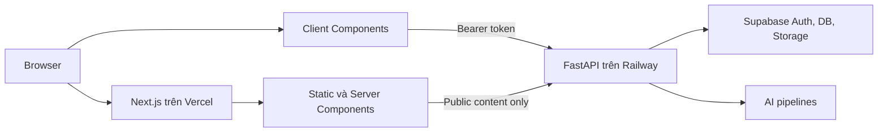
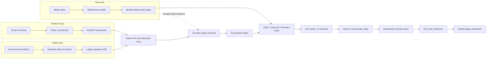

# Master Plan: Migration Frontend sang Next.js

**Dự án:** IELTS Speaking Coach / Aver Learning  
**Ngày:** 2026-07-12 · v3 revised: 2026-07-13  
**Phiên bản:** v3 — v2 đã qua adversarial review về architecture, delivery và safety; v3 bổ sung discovery validation độc lập trực tiếp trên repo (2026-07-13, HEAD `3f031d17`, 11 commits sau baseline `9047e09f`), yêu cầu đóng destination decision (ADR-000, mục 1.2), thêm bottleneck B34–B38 và hiệu chỉnh kế hoạch hai tuần đầu theo dữ kiện đã xác minh  
**Trạng thái:** Conditional Go — discovery/dark launch được phép; bốn production pilot chỉ được cutover sau Gate A + Gate B + per-pilot entry checklist; Gate C chỉ mở bounded ramp tối đa 10 routes/ít nhất 2 domains; Gate D mới mở broad parallel scale. Cập nhật 2026-07-13: ADR-000 đã ratify (Next.js — mục 1.2); Vercel tier đã xác minh: **Hobby** (B34) — phải nâng Pro trước production pilot cutover đầu tiên  
**Kiến trúc đích:** Next.js App Router trên Vercel; FastAPI/Railway tiếp tục là backend canonical  
**Phương pháp:** Incremental strangler migration, một deployment, route-level cutover; rollback bằng deployment trừ khi ADR-007 duyệt control plane riêng  

---

## 1. Executive decision

Chọn **Next.js App Router** làm kiến trúc frontend dài hạn vì sản phẩm đang chuyển từ một website nhiều trang sang một learning application gồm nhiều workflow tương tác: practice, full test, grading, reading/listening players, writing, vocabulary, instructor và hơn 60 admin pages.

Migration được thực hiện theo các nguyên tắc:

1. Không big-bang và không dùng long-lived migration branch.
2. Legacy HTML/JS và Next.js cùng chạy trong một Vercel deployment trong giai đoạn chuyển tiếp.
3. FastAPI vẫn là nơi duy nhất chứa business logic, authorization, grading, AI và persistence.
4. Supabase Auth model không thay đổi trong migration chính.
5. Mỗi route được dark-launch/cutover độc lập; rollback route cần một deployment mới trừ khi dự án chủ động đầu tư routing control plane.
6. Không retire legacy test cho đến khi invariant tương ứng có replacement.
7. Không redesign UI, nâng Tailwind major version hoặc đổi backend contract đồng thời với migration.
8. Core flows có grading, audio và persistence được migrate cuối cùng.

Không dùng `output: "export"` làm kiến trúc đích. Next.js được deploy theo hybrid rendering trên Vercel để sử dụng Server Components, server-rendered metadata và caching/revalidation cho public content. Điều này không cho phép business logic trôi vào Next.js.

### 1.1 Verdict sau phản biện

Hướng kiến trúc được giữ nguyên, nhưng bản v1 chưa execution-ready. Các giả định sau đã bị bác bỏ và được sửa trong v2:

- Vercel Preview không tự dùng staging chỉ nhờ khai báo environment variables; legacy hiện hard-code production API/Supabase và cần runtime configuration chung.
- `/__legacy` không tự tạo ra route-level rollback an toàn; Vercel Instant Rollback là rollback toàn deployment.
- Ba pilot dễ không đủ chứng minh mutation, media, state recovery và persistence.
- Internal URL là dark launch, không phải production canary trên canonical traffic.
- Frontend rollback không sửa được dữ liệu đã ghi sai; cần mutation, reconciliation và repair contract.
- Phase model tuyến tính làm chậm chương trình; Safety/Platform hội tụ ở Gate A/B cho bounded pilot entry, còn cả ba workstreams cùng pilot evidence hội tụ ở Gate C cho scale decision.
- Estimate v1 không có bottom-up WBS và thấp hơn mức rủi ro thực tế.

V2 vì vậy coi Phase 0–2 là **investment discovery có timebox và kill decision**, không phải cam kết chắc chắn migrate toàn bộ repo.

### 1.2 Destination decision phải được đóng chính thức (v3)

Tài liệu `docs/FE_MIGRATION_DECISION_2026-07-11.md` — viết một ngày trước plan này — khuyến nghị **Astro + React islands** và chỉ chọn Next.js "nếu tầm nhìn sản phẩm là frontend trở thành một React application". Master plan này chọn Next.js nhưng không dẫn chiếu hay đóng lại khuyến nghị đó: hồ sơ dự án hiện chứa hai khuyến nghị mâu thuẫn nhau.

- **ADR-000 — Destination:** steering phải ratify việc chọn Next.js với lý do tường minh (state xuyên navigation, một hệ hình TSX duy nhất, Context bao trùm toàn trang — tức chính nhánh "React application" mà decision doc đã mô tả), và đánh dấu khuyến nghị Astro 2026-07-11 là *superseded*. ADR-000 đóng trước mọi ADR khác; chưa đóng thì chưa bắt đầu Phase 0. **Status: RATIFIED 2026-07-13 — Next.js; khuyến nghị Astro 2026-07-11 chính thức superseded.**
- Nếu Gate C chọn "reconsider destination", **Astro là alternative đã được nghiên cứu sẵn** — stop decision ở mục 17 đối chiếu lại tài liệu 2026-07-11 thay vì nghiên cứu lại từ đầu.
- Phần lớn Phase 0 là **no-regret**: runtime config, environment isolation, staging certification, E2E flows, CI test-manifest fix và route/test ledger giữ nguyên giá trị cho cả hai destination lẫn kịch bản không migrate. Điều này phải được nêu rõ trong Discovery Contract để kill decision không bị bóp méo bởi sunk cost.

---

## 2. Goal và success criteria

### 2.1 Goal chính

Trong một chuỗi release có thể rollback, chuyển frontend production sang một hệ thống thống nhất dựa trên Next.js, React và TypeScript, đồng thời bảo toàn URL, auth, API contract, dữ liệu đã lưu và hành vi người dùng hiện tại.

### 2.2 Kết quả mong muốn

- Một frontend component model thống nhất cho student, instructor và admin.
- Shared layouts, providers, error boundaries và design primitives.
- Public content được server-rendered với metadata thật cho SEO.
- Business UI state không còn phụ thuộc rộng vào `window.*` globals.
- Không còn inline business logic sau Phase Eliminate.
- OpenAPI drift cho endpoints đã migrate trở thành CI blocking.
- Có component tests, browser integration tests và staging E2E thật.
- Một package/build/deploy pipeline sau khi legacy được loại bỏ.
- FastAPI, Supabase và các pipeline AI không phải migrate sang JavaScript.

### 2.3 Chỉ số hoàn thành

Migration chỉ được coi là hoàn tất khi:

- 100% route production trong route ledger do Next.js sở hữu hoặc là compatibility redirect đã được duyệt.
- Không còn production route render implementation từ legacy HTML.
- Không mất query parameter, hash navigation hoặc deep link hiện tại.
- Không có Sev1/2 mới hoặc persistence-invariant violation; error/API-failure threshold cụ thể được freeze trong từng cutover sheet.
- Các flow grading/persistence cho kết quả giống legacy khi reload lại trang.
- Public pages đạt mục tiêu Core Web Vitals: LCP p75 dưới 2,5 giây, INP p75 dưới 200 ms, CLS p75 dưới 0,1, hoặc không kém baseline đã đo nếu hạ tầng backend là giới hạn chính.
- Không có critical/serious accessibility issue trong automated gate.
- Mọi legacy test đã được port, thay thế hoặc retire với lý do được duyệt.
- Full-deployment rollback và route emergency redeploy/control-plane rollback (nếu có) đã diễn tập, đo MTTD/decision/execution/total recovery cùng backup/PITR RPO + restore RTO.
- Preview/staging artifact, compiled rewrites, browser/server traces và production access logs chứng minh zero request tới production API, Supabase hoặc telemetry origin.
- Mọi mutation đã migrate có idempotency/retry/reconciliation/repair policy.
- Auth account switch không để lộ cache hoặc dữ liệu của user trước.
- API và environment duy trì compatibility cho cả frontend N và N−1 trong rollback window.
- Khi có ít nhất 5 routes qua ít nhất 2 representative domains, và không muộn hơn route 10, có bằng chứng về lead time, escaped defects, change-failure rate hoặc component reuse đạt frozen threshold; parity đơn thuần chưa đủ để tiếp tục đầu tư vô hạn.

---

## 3. Baseline đã audit

Các số liệu dưới đây đã được refresh theo commit `9047e09f` ngày 2026-07-12, không phải số liệu cố định cho toàn migration. Production HTML loại `practice.legacy.html` và bốn HTML test fixtures; contract/source tests không tính bốn Playwright spec đã liệt kê riêng.

| Hạng mục | Baseline |
|---|---:|
| Production HTML | 123 trang, khoảng 37.984 dòng |
| Admin HTML | 65 trang |
| Instructor HTML | 3 trang |
| Student-facing pages dưới `frontend/pages` | 48 trang |
| Root HTML | 7 trang |
| Frontend JS ngoài tests | 119 file, khoảng 38.309 dòng |
| Production script-block lines, tính cả tag | khoảng 14.938 dòng |
| Frontend contract/source tests | 214 file, khoảng 45.266 dòng |
| Playwright hiện tại | 4 spec files, 6 test cases; static fixture smoke, chưa phải full-stack E2E |
| Hardcoded navigation/location references | khoảng 436 references |
| Shared chrome adoption | 102/123 production pages dùng Web Components |
| Grammar Wiki runtime articles | khoảng 137 bài |
| Source control-byte hazard | 2 production files chứa literal NUL: `frontend/js/vocabulary.js`, `frontend/pages/admin/vocab/content.html` |

Những vùng có rủi ro cao nhất theo kích thước và mức độ stateful:

| Vùng | Dấu hiệu rủi ro |
|---|---|
| `practice.js` | khoảng 3.167 dòng; recording, grading, full-test chaining, persistence |
| `speaking.html` | khoảng 2.539 dòng; 1.731 dòng inline script |
| `reading-exam.js` | khoảng 2.613 dòng; exam state, local/session storage |
| `admin/writing/grade.html` | khoảng 2.045 dòng; 1.635 dòng inline script |
| `writing-dashboard.html` | khoảng 1.981 dòng; 1.572 dòng inline script |
| `result.html` | khoảng 1.357 dòng; 1.165 dòng inline script |
| Listening test player | audio lifecycle, grading, browser compatibility |

### 3.1 Kiểm chứng độc lập (v3 — 2026-07-13, HEAD `3f031d17`)

Toàn bộ claim baseline được re-verify trực tiếp trên working tree, 11 commits sau baseline commit. Kết quả: **các claim kỹ thuật nền tảng của v2 đều đúng**, với các hiệu chỉnh sau:

| Hạng mục | v2 | Đo lại 2026-07-13 | Ghi chú |
|---|---|---|---|
| Production HTML | 123 trang / ~37.984 dòng | 124 trang / ~38.746 dòng | Tree tiếp tục phình khi chưa có new-page rule — xem B38 |
| Frontend JS ngoài tests | 119 file / ~38.309 dòng | 119 file / ~38.689 dòng | Khớp |
| Contract/source tests | 214 file | 214 file (+4 Playwright) — đếm lại chính xác bằng `find`, con số 221/225 trong bản đo đầu là lệch | CI chạy 131 file theo explicit list → gap 83. **Đã fix bằng glob — PR #729 (2026-07-13)**, kèm 5 drift được vá; runtime config (B1/§7.1) ở PR #730 |
| Supabase production ref hardcode | 110 files | 111 files; 2 project refs (`huwsmtubwulikhlmcirx` + legacy `nqhrtqspznepmveyurzm`) | |
| Hardcoded navigation refs | ~436 | ~408 | |
| Shared chrome adoption | 102/123 | 101/124 | 3 Web Components: `aver-chrome` 757 dòng, `aver-admin-chrome` 803 dòng, `audio-player` 540 dòng — cần port sang React hoặc giữ nguyên qua script trong coexistence |
| Grammar runtime articles | ~137 | 150 markdown files | Ước lượng v2 conservative |
| Literal NUL bytes | 2 files | **Xác nhận đúng** — mỗi file 1 NUL, dùng làm compound-key delimiter (`selKey = c + '\x00' + s`) | Grep thường báo "binary file" và bỏ sót — đúng như B33 cảnh báo; phải dùng byte-level scanner |
| `api.js` hostname inference | đúng | Xác nhận tại `frontend/js/api.js:44-48`: non-localhost → Railway production | |
| `/api/public-stats` external rewrite | đúng | Xác nhận: `frontend/vercel.json` hardcode production Railway; tổng cộng 11 rewrites, 18 redirects, 4 header rules | |
| Playwright | 4 spec / 6 cases, static fixture | Xác nhận: chromium-only, serve bằng `python3 -m http.server 4173` | |

Dữ kiện mới v2 chưa ghi nhận:

- **Staging đã có mầm:** `backend/.env.staging` tồn tại và trỏ tới một Supabase project staging riêng (`zjphffoujxkpltixsbzj`) — khác cả production lẫn legacy project. Chưa có Railway staging deployment nào được tham chiếu ở bất kỳ đâu trong repo. B1 vì vậy thu hẹp thành: *provision Railway staging + certify*, không phải dựng từ số không.
- **CORS đã sẵn sàng cho staging hostname:** `backend/main.py:138` có regex `^https://(?:[a-z0-9-]+\.)?averlearning\.com$` — `staging.averlearning.com` pass CORS ngay hôm nay; generic `*.vercel.app` bị từ chối (nhất quán với chính sách mục 7.1).
- **Vercel production project không nằm trong account Vercel đang authenticated trên máy dev** (team cá nhân hiện không có project nào) → plan tier (Hobby/Pro), phạm vi Instant Rollback và rolling-release capability **chưa xác minh được** — xem B34.
- **Backend feature flags là global env, đọc lúc process start** (`backend/config.py`, 20+ flags) — đổi flag cần restart/redeploy Railway. Chưa tồn tại cơ chế kill switch per-request — xem B37.
- `supabase-js@2.107.0` nạp qua CDN jsdelivr trong từng HTML — thuộc diện inventory/pin CDN dependency ở Phase 1. Không tìm thấy cấu hình `flowType`/PKCE nào → client đang chạy default (implicit) đúng như giả định parity của ADR-003.
- Admin HTML đếm được 65 file trong khi Phase 5 nói "62 admin pages" — route ledger phải chuẩn hóa con số này thay vì để hai số cùng tồn tại.
- **Migrations không bootstrap được database mới từ zero** (phát hiện khi dựng staging 2026-07-13): `backend/migrations/` bắt đầu từ `001` là ALTER trên một base schema được tạo ngoài repo — không file nào tạo `users`/`sessions`/`responses`. Bootstrap môi trường mới phải clone cấu trúc từ production (`backend/scripts/staging_clone_schema_from_prod.sh`); `apply_migrations.sh` chỉ dành cho migrations tăng dần về sau. Ràng buộc này cũng áp cho per-run data factory và mọi ephemeral test DB ở Phase 0.

---

## 4. Target architecture



### 4.1 Boundary bắt buộc

**Next.js sở hữu:**

- Routing, layouts và metadata.
- Server rendering của public content.
- React UI state và shared frontend components.
- Loading, error và not-found boundaries.
- Frontend analytics/error integration.

**FastAPI sở hữu:**

- Authentication verification và authorization truth.
- Grading, session finalization và persistence.
- Admin permissions.
- Content authoring APIs.
- AI calls, rate limits và cost controls.
- Business validation và database writes.

**Không được làm trong migration:**

- Tạo Next API route để duplicate FastAPI endpoint.
- Chuyển grading hoặc admin mutations sang Server Actions.
- Tin client-side role hoặc Next route guard là security boundary.
- Dùng Vercel KV/DB thay cho dữ liệu canonical hiện tại.

### 4.2 Rendering rules

- Server Component là mặc định.
- Chỉ dùng Client Component khi cần state, effect, browser API, audio, recording, form interaction hoặc client cache.
- Đặt `"use client"` ở boundary nhỏ nhất; không đặt ở root layout nếu không bắt buộc.
- Public Grammar pages fetch từ FastAPI ở server với cache semantics được khai báo tường minh; không dựa vào default của Next.js.
- Authenticated data ban đầu được fetch client-side trực tiếp từ FastAPI và luôn `no-store` ở mọi shared/server layer.
- Không chuyển Supabase browser session sang cookie SSR trong migration chính.
- HTML từ Markdown chỉ render qua một sanitized content renderer.
- `public-server-api` là module `server-only`, chỉ allowlist public GET endpoints và không nhận cookie/Authorization.
- `authenticated-browser-api` là module `client-only`; không cho bearer token đi qua RSC trong migration chính.
- Upload, audio và FormData tiếp tục đi trực tiếp từ browser tới FastAPI để tránh Vercel body/runtime limits.
- Root layout không được đọc cookie/header cho auth trong migration chính, tránh biến toàn bộ public tree thành dynamic.

### 4.3 Cấu trúc thư mục đề xuất

```text
frontend/
├── app/
│   ├── (marketing)/
│   ├── (public-content)/
│   │   └── grammar/[category]/[slug]/
│   ├── (student)/
│   │   ├── home/
│   │   ├── speaking/
│   │   ├── writing/
│   │   ├── reading/
│   │   ├── listening/
│   │   └── vocabulary/
│   ├── instructor/
│   └── admin/
├── components/
│   ├── ui/
│   ├── layout/
│   ├── feedback/
│   ├── exam/
│   └── admin/
├── features/
├── lib/
│   ├── api/
│   ├── auth/
│   ├── analytics/
│   ├── errors/
│   └── routes/
├── generated/
├── legacy/
├── public/
└── tests/
```

---

## 5. Required decision records

Trước production pilot đầu tiên, cần chốt ADR-001 đến ADR-010 và ADR-012. ADR-011 phải chốt trước authenticated pilot đầu tiên; toàn bộ mười hai ADR phải đóng trước Gate C:

1. **ADR-001 — Backend boundary:** FastAPI là business backend duy nhất.
2. **ADR-002 — URL ownership:** canonical URLs, `.html` compatibility, redirect policy; `next.config` là source of truth cho same-application rewrites và mỗi rule ghi rõ `beforeFiles`/`afterFiles`/`fallback` phase.
3. **ADR-003 — Auth model:** giữ Supabase browser session trong migration và chọn đúng một OAuth contract; implicit hash là mặc định parity, PKCE `?code=` là work package riêng nếu được duyệt và phải exchange code đúng contract.
4. **ADR-004 — Rendering:** Server Component mặc định, client boundary hẹp.
5. **ADR-005 — Test retirement:** invariant mapping bắt buộc trước khi xóa test.
6. **ADR-006 — Runtime environment provenance:** generated public config, compiled rewrite/server-egress provenance, zero-production-egress Preview và secret boundaries.
7. **ADR-007 — Rollout/rollback control:** dark launch, production canary capability, attempt/session affinity, recovery metrics và Vercel plan constraints.
8. **ADR-008 — Public content caching:** runtime, region, TTL/tag invalidation, stale/error semantics và freshness SLO.
9. **ADR-009 — Backend/environment compatibility:** N/N−1 API window, key rotation overlap và rollback eligibility.
10. **ADR-010 — Mutation/data recovery:** retry, idempotency, ambiguous commit, reconciliation, repair và mutation kill switch.

11. **ADR-011 — Auth state machine:** refresh, logout, cross-tab, account switch, role revoke và user-scoped cache clearing.
12. **ADR-012 — Observability contract:** environment/release/implementation tags, request correlation, SLO, alerts, redaction và retention.

Các ADR này là guard chống scope creep, không phải tài liệu hình thức.

**Trạng thái 2026-07-13:** đủ 12 ADR đã được viết tại `docs/adr/` (000 nằm trong §1.2; 006 và 010 đã ship kèm code). Điều kiện mở còn lại của từng ADR ghi trong `docs/adr/README.md`.

---

## 6. Critical path



Ba lane có thể chạy song song với owner riêng. Safety và Platform phải đạt Gate A/B trước production pilot entry; Risk spikes chạy song song nhưng mutation/data-safety evidence phải có trước mutation pilot. Pilot soak và các risk-spike results mới hội tụ tại Gate C để quyết định bounded ramp; Gate D mới mở broad parallel scale. Phase labels là milestones, không phải barrier bắt mọi domain chờ nhau. Pre-Gate-C risk spikes là discovery artifacts; core domain implementation chỉ bắt đầu sau Gate C trong WIP limit. Canonical core cutover chỉ được phép sau Gate E và không phụ thuộc việc migrate xong toàn bộ admin pages.

E2E trong Safety lane trước hết là **legacy baseline E2E**. Sau khi Next route xuất hiện, cùng invariant mới được chạy thành cross-implementation parity E2E.

---

## 7. Requirements trước implementation

### 7.1 Environment matrix

| Environment | Next frontend | Backend | Supabase | AI behavior |
|---|---|---|---|---|
| Local | `next dev` | FastAPI local | Test/local | Fixture by default |
| Preview | Vercel Preview | Railway staging | Supabase staging | Deterministic fixture |
| Production | Vercel Production | Railway production | Supabase production | Real providers |

Preview Deployment không được tự động gọi production database hoặc production grading.

Điều này chưa đúng với legacy tại commit baseline: `api.js` chọn Railway production cho mọi hostname không phải localhost; 110 HTML/JS files chứa Supabase production project ref; `frontend/vercel.json` còn proxy `/api/public-stats` thẳng tới Railway production. Vì external rewrite chạy tại Vercel/CDN, browser chỉ thấy same-origin request và browser trace một mình không phát hiện được upstream production. Environment variables của Next.js **không đủ** để cô lập Preview.

Dữ kiện đã xác minh 2026-07-13 (mục 3.1): con số đúng là 111 files với 2 project refs; `backend/.env.staging` đã trỏ sẵn một Supabase staging project riêng và CORS backend đã chấp nhận mọi subdomain `*.averlearning.com` — hạng mục hạ tầng còn thiếu duy nhất trước khi certify matrix này là **provision Railway staging service**.

Trước khi chạy authenticated Preview:

- Tạo generated `runtime-config.js` dùng chung cho Next và legacy, chỉ chứa public values: environment, API base, Supabase URL/anon key, telemetry environment và release SHA.
- `api.js` và `initSupabase()` phải ưu tiên runtime config; bỏ hostname inference.
- Build Preview fail nếu runtime config thiếu hoặc nếu deployable artifact/compiled rewrites còn production API/Supabase/telemetry origin ngoài allowlist tài liệu.
- Browser integration fail ngay khi network request từ Preview đi tới production origin; server-side fetch/rewrite cũng phải có outbound-origin allowlist, trace và production-backend access-log assertion.
- `/api/public-stats` phải dùng environment-aware destination hoặc direct runtime-config API call; Preview test phải chứng minh Railway production không nhận request.
- Same-application legacy rewrites chuyển về `next.config` theo ADR-002; deployed route manifest, không phải config source, là bằng chứng ownership cuối cùng.
- Dùng một staging hostname ổn định dưới `averlearning.com` cho authenticated E2E/OAuth; không mở CORS rộng cho mọi `*.vercel.app`.
- PR Preview ngẫu nhiên chỉ được test public/read-only behavior nếu chưa có callback/origin allowlist an toàn.

Mỗi staging release phải tạo environment-certification artifact gồm migration head/checksum, RLS/functions, storage buckets, OAuth callbacks, CORS rules, feature-flag manifest, seed version và provider mode. Mỗi production candidate và rollback target có provenance artifact đối xứng: chỉ production origins, fixture disabled, exact release/env SHA và key-overlap validity. Không copy production PII vào staging.

### 7.2 Test identities và data

Cần seed tối thiểu:

- Anonymous visitor.
- User chưa activation.
- Activated student.
- Instructor.
- Admin.
- Student có session/response history.
- Full-test session gồm đủ Part 1, 2, 3.
- Writing submission ở các trạng thái queue/grading/completed.
- Reading/listening attempt và review data.
- Access code chưa dùng, đã dùng, revoked và association lookup failure fixture.

### 7.3 Route ledger

123 HTML files không đồng nghĩa 123 route contracts. Inventory bắt đầu từ 123 production files tại baseline commit nhưng phải normalize thành canonical route patterns, dynamic patterns, aliases, redirects và browser-visible URLs. Mỗi pattern chỉ có một phase/domain owner; pilot được credit vào domain phase thay vì bị estimate hai lần.

Mỗi route pattern có các trường:

| Trường | Ý nghĩa |
|---|---|
| Legacy URL | URL production hiện tại |
| Target URL | URL Next.js đích |
| Canonical policy | Giữ URL hay redirect |
| Query/hash contract | `session_id`, `test_id`, `attempt_id`, anchors... |
| Auth level | public/student/instructor/admin |
| API dependencies | Endpoints và response shapes |
| Browser dependencies | Audio, recorder, clipboard, storage... |
| Complexity | S/M/L/XL |
| Route ownership graph | App route, public file, rewrite source/destination, redirect, alias và headers |
| Browser-visible base path | Path dùng để resolve relative asset/link/iframe |
| Environment dependencies | API/Supabase/telemetry origins và public env vars |
| Backend compatibility | Minimum/maximum compatible API version và deprecated fields |
| Mutation safety | Retry, idempotency, reconcile, repair và kill-switch policy |
| Legacy tests | Tests đang bảo vệ invariant |
| Replacement tests | Unit/component/browser/E2E |
| Rollback route | Fallback implementation |
| Owner/status | Người phụ trách và trạng thái |

### 7.4 Test invariant ledger

Không quản lý test chỉ theo filename. Mỗi test phải được gắn với invariant, ví dụ:

- API request dùng đúng Railway base URL.
- Grade không được hiển thị nếu persistence thất bại.
- Admin association lookup failure không được render như dữ liệu rỗng.
- URL grammar recommendation phải giữ category/slug/anchor.
- Access-code redemption history không bị reset.
- Reading attempt reload không làm mất câu trả lời.

---

## 8. Coexistence design

### 8.1 Chọn cơ chế đơn giản trước

Bản v1 đề xuất generated copy pipeline cho toàn legacy tree. Cơ chế đó tránh một diff lớn nhưng tự tạo watcher, stale-output và duplicated-artifact risk. V2 chọn mặc định:

- Dùng một PR cơ học với `git mv` để đưa deployable legacy HTML/JS/CSS/assets vào `frontend/public/`, giữ nguyên URL shape.
- Cập nhật test path constants trong cùng PR; không đổi behavior.
- Lưu manifest hash trước/sau và kiểm tra byte parity cho deployable files.
- Giữ tests, tooling, types và package files ngoài `public/`.
- Cho phép generated-copy alternative chỉ khi spike chứng minh direct move không khả thi; alternative phải có owner, watcher strategy và deletion date.

Trong thời gian root chưa migrate, `/` phải rewrite rõ tới `/index.html`; dark-launch Next đầu tiên dùng namespace riêng. Không giả định `public/index.html` tự sở hữu `/`.

### 8.2 Route ownership graph

Ownership compiler phải tổng hợp:

- Next `app/` static/dynamic routes.
- Files trong `public/`.
- `vercel.json` redirects, rewrites và headers.
- Clean URL aliases như `/home`, `/speaking`, `/writing/*`.
- Fallback/internal rules.

Build fail nếu App route trùng public path hoặc rewrite source. Ví dụ Grammar pilot chỉ được cutover atomically khi legacy rewrite `/grammar/:category/:slug` được gỡ trong cùng change.

Route graph phải được kiểm tra cả local lẫn deployed Preview vì Vercel routing order là một phần của contract.

### 8.3 Navigation seam

- Next-owned destination dùng Next `<Link>`.
- Legacy-owned destination dùng plain `<a>` hoặc `window.location.assign`, luôn full-document navigation và không prefetch RSC payload.
- Một `RouteLink` helper đọc ownership manifest; developer không tự đoán route type.
- E2E bắt buộc Next → legacy → Next, kiểm tra auth session, theme, query/hash, console và network errors.
- Không dùng global auth middleware trong coexistence trừ khi matcher loại đúng legacy HTML/assets, `_next/static`, media và fallback paths.

### 8.4 Legacy fallback và rollback thực tế

Vercel Instant Rollback là rollback toàn deployment. Route-level rollback mặc định là **emergency source/config change + deployment mới**, không phải instant toggle. Mỗi drill phải báo riêng MTTD từ first observable impact đến detection, decision latency, execution từ rollback command đến verified recovery và total impact-to-recovery. Trigger đủ điều kiện phải được pre-authorize; target execution:

- Full-deployment rollback execution: dưới 5 phút từ command đến verified recovery.
- Route emergency redeploy execution: dưới 15 phút từ command đến verified recovery.
- Data-integrity objective: zero unreconciled loss, duplicate hoặc unauthorized write. Backup/PITR RPO và restore RTO được ghi riêng; frontend rollback không được gọi là data recovery.

`/__legacy` chỉ được dùng cho selected high-risk routes nếu spike chứng minh được internal rewrite giữ canonical browser-visible URL. Không cam kết direct navigation tới fallback file hoạt động.

Nếu dùng fallback:

- Test relative JS/CSS/media, nested paths, iframe/postMessage, auth, query và hash từ canonical URL.
- Gắn `X-Robots-Tag: noindex, nofollow` ở response header.
- Có expiry date và patch owner; fallback vẫn là production attack surface.
- Không inject `<base>` tự động nếu chưa kiểm tra anchors và relative navigation.

Nếu business yêu cầu instant per-route switch, phải duyệt riêng routing control plane (signed cookie/Proxy/external state), failure mode, audit, owner và chi phí. Không lén thêm middleware như implementation detail.

### 8.5 URL và compatibility policy

- Không đổi mọi URL sang clean URL trong một lần.
- Legacy `.html` URLs được giữ hoặc redirect từng route.
- Fragment không được gửi tới server; browser tests phải chứng minh hash behavior thay vì tuyên bố server “preserve hash”.
- Existing inbound deep links được kiểm tra bằng crawler tải cả document, JS, CSS và media.
- FastAPI duy trì frontend N/N−1 compatibility suốt rollback window; không xóa field/endpoint khi eligible legacy/rollback deployment còn tồn tại.
- Secret/key rotation cần overlap hoặc được freeze trong rollback window.
- `vercel.json` được giảm dần theo route; effective cache/security headers trên `/_next/static`, Next fonts, legacy assets, HTML và RSC requests phải được test trên Preview.

---

## 9. Migration roadmap

### Phase 0 — Baseline và safety infrastructure

**ROM effort:** 4–7 person-weeks (PW); reforecast sau environment discovery  
**Mục tiêu:** Có environment isolation, dữ liệu synthetic, fault-capable fixtures và legacy baseline đủ để đánh giá parity.

Deliverables:

- Hoàn thành route ledger.
- Hoàn thành test invariant ledger.
- Chạy binary-safe control-byte inventory; characterization-test rồi thay literal NUL bằng escaped representation trong behavior-preserving PR trước khi parse/convert source liên quan.
- Xác định CI hiện chạy test nào: workflow hiện chỉ liệt kê 131/214 frontend test files; 83 files còn lại phải được đưa vào gate hoặc có exclusion reason/owner.
- Generated runtime config dùng chung và zero-production-egress checks.
- Baseline Lighthouse, bundle, request count, error rate và key API timings.
- Environment certification cho Railway/Supabase staging.
- Per-run synthetic test-data factory, cleanup/TTL và resource locking cho destructive tests.
- Deterministic grading fixture mode có happy path và fault modes: timeout, 429, 5xx, malformed payload, partial save, persistence failure và response-lost-after-commit.
- Backend phải abort startup nếu fixture mode đi cùng production environment/project; client không được chọn provider mode.
- Observability baseline và event schema bản đầu.
- Ba staging E2E đầu tiên:
  - Login/activation.
  - Practice → grade → result.
  - Admin access-code flow.
- Rollback runbook bản đầu.

Auth automation tách thành ba tầng: PR tests bootstrap synthetic Supabase session/storage state; staging integration dùng synthetic account; Google OAuth chỉ là scheduled/manual smoke, không giữ provider credential trong CI.

**Gate:** Không cutover pilot nếu Preview còn production egress, fixture chưa fail-closed, E2E data chưa isolated hoặc chưa đạt 20 full-suite executions liên tiếp trên frozen environment/browser matrix. Bất kỳ retry nào reset streak; exclusion được chấp nhận phải có owner và expiry; cross-test contamination phải bằng 0.

### Phase 1 — Next scaffold và coexistence

**ROM effort:** 4–6 PW  
**Mục tiêu:** Chứng minh Next và legacy chạy chung trong một deployment.

Deliverables:

- Next App Router + TypeScript strict.
- Node stable/LTS và dependency lockfile được pin.
- Mechanical legacy move/public coexistence và compiled route ownership graph.
- Existing `--av-*` tokens được dùng nguyên vẹn.
- Tailwind 3.4.17 tiếp tục phục vụ legacy; chưa nâng major.
- API client, Supabase client singleton, auth provider và route constants.
- API semantics contract: 204/empty, 401/403/422/429/5xx, FormData, custom reading headers, abort/timeout, runtime validation và retry policy.
- Auth state machine skeleton: initial loading, refresh, signed-out, refresh failure, cross-tab logout, account switch và role refresh từ `/auth/me`.
- User-scoped cache/storage phải clear và in-flight request phải abort khi logout/account switch.
- Error boundaries và analytics/error reporting adapter.
- Vitest, React Testing Library và Playwright configuration.
- OpenAPI generation chạy trong CI; ban đầu advisory trong thời gian scaffold, chuyển blocking trước pilot cutover.
- Vercel Preview dùng staging backend.
- Pin cùng Node major cho local, CI và Vercel; inventory/pin external CDN dependencies trước khi thay bằng npm.
- Capture Vercel project settings: plan, Root Directory, framework preset, build command, regions, environment scopes, rollback eligibility và rolling-release capability.

**Gate:**

- Legacy parity tests xanh.
- Không public/app collision.
- Preview artifact, compiled rewrites, browser network, server-side outbound trace và production-backend access log chứng minh zero production egress.
- Compiled route graph không có public/app/rewrite-source collision; deployed ownership probe chứng minh Grammar legacy rule còn sở hữu canonical route cho tới atomic cutover.
- Next → legacy → Next navigation seam xanh.
- Full-deployment rollback và route emergency redeploy đạt execution target; MTTD, decision latency và total impact-to-recovery cũng được đo.
- Một dark-launch Next route có thể deploy mà không ảnh hưởng legacy root.

### Phase 2 — Bốn production pilots và critical-risk spikes

**ROM effort:** 6–10 PW  
**Mục tiêu:** Đo chi phí thật và retire unknowns lớn trước khi scale.

**Per-pilot entry checklist:**

- Tất cả pilot: Gate A/B pass, ADR-012 đóng, production-candidate/rollback provenance xanh, implementation/release tags có dashboard và rollback trigger được freeze.
- Authenticated pilot: ADR-011 đóng; effective private responses có `Cache-Control: private, no-store`, không có shared-cache header; logout → back/forward/reload và Login A → Login B không phục hồi dữ liệu cũ.
- Mutation pilot: staging failure injection đã chứng minh idempotency hoặc retry-off, canonical reconcile GET, DB invariant checks, kill switch và repair dry-run; N/N−1 consumer test và backend-deploy/frontend-rollback drill xanh.
- Checklist chỉ cho phép đúng bốn bounded pilots. Nó không phải quyền scale và không thay Gate C.

Pilot bắt buộc:

1. Static marketing: pricing hoặc landing.
2. Public content: Grammar article `[category]/[slug]`.
3. Authenticated read route: profile hoặc admin overview rủi ro thấp.
4. Authenticated reversible mutation: profile update hoặc mutation tương đương, gồm validation, 401/403, double submit, timeout-after-commit, canonical reload và account switch.

Critical-risk spikes không nhất thiết cutover nhưng phải có artifact và exit criteria:

1. MediaRecorder/audio mount–unmount, permission và upload trên Safari/iOS/Chromium.
2. Practice state-machine qua refresh/back/reopen/resume.
3. Legacy-start → Next-resume và Next-start → legacy-resume trên cùng backend session.
4. Grading fixture payload/UI/DB parity, gồm ambiguous commit và partial persistence.

Đo:

- Engineer-hours.
- Diff size.
- Client JS gzip.
- Lighthouse và Web Vitals.
- API request count.
- Test replacement ratio.
- Visual/accessibility parity.
- Preview/staged-production error rate.
- Lead time, escaped defects, component reuse và test maintenance so với baseline.

**Investment gate:** Nếu hai pilot trở lên vượt 2× frozen estimate, critical spike thất bại sau một remediation cycle, hoặc architecture buộc đổi auth/business backend, steering review phải chọn rõ: continue, scope hẹp, pause, giữ Next cho một số domain, hoặc terminate/reconsider destination.

### Phase 3 — Marketing và public content

**ROM effort:** 5–8 PW

Phạm vi:

- Landing, pricing và public navigation.
- Grammar home, search, article, roadmap, compare và exercises.
- Metadata, canonical, sitemap, robots và structured data.

Grammar Wiki dùng một dynamic route template; 137 bài không phải 137 UI rewrites. ADR-008 phải chọn chính xác dynamic SSR, TTL cache hay pre-generated subset; mọi server `fetch` khai báo `cache`/`revalidate` rõ ràng. Chốt Node runtime, Vercel region gần Railway, abort timeout, freshness SLO, stale/error behavior, cache-hit ratio và invalidation path. `generateMetadata` và page body phải dùng cùng memoized loader.

Nếu cần invalidation nhanh, một signed internal revalidation Route Handler được phép như control-plane exception; nó không được chứa content/business API logic. Nếu chỉ dùng TTL, editor-facing stale window phải được ghi rõ.

Login/onboarding **không** được gộp vào marketing estimate. Giữ functional `/login.html` legacy cho đến khi auth callback slice riêng có characterization tests cho OAuth contract được ADR-003 chọn, inactive/activated user, logout, refresh failure và Supabase redirect allowlist. Không coi nhánh `?code=` hiện hữu là bằng chứng PKCE hoạt động.

### Phase 4 — Student shell và medium-risk flows

**ROM effort:** 8–14 PW

Phạm vi:

- Auth callback/login là work package riêng sau Gate C và ADR-011; hoàn tất trước khi chuyển các entry paths authenticated, không tính vào marketing phase.
- Home và profile.
- Vocabulary landing, flashcards và quiz progress.
- Grammar quiz.
- Reading/listening landing, browse và drill độc lập.
- Shared student layouts và navigation.

Primitives cần hoàn tất:

- Page header và shell.
- Loading/error/empty states.
- Tabs, dialog, toast và confirmation.
- Forms và validation display.
- Audio player.
- Permission/access lock.
- Feedback panels.

Chỉ khi Gate C quyết định **continue**, route mới trong approved migration scope phải viết bằng Next.js trong bounded ramp tối đa 10 routes/ít nhất 2 domains. Gate D mới cho broad parallel domain scale. Route ngoài scope đi qua feature decision tree/exception có port-debt owner; nếu quyết định pause/partial/terminate thì policy tương ứng được ghi lại thay vì âm thầm mở rộng hai stack.

Các pilot đã production-grade được trừ khỏi scope/estimate của phase tương ứng.

### Phase 5 — Admin và instructor theo domain

**ROM effort:** 16–24 PW

Không migrate 62 admin pages như 62 sản phẩm riêng. Thứ tự:

1. Admin shell và role guard UX.
2. Table/filter/pagination primitives.
3. Form/modal/confirmation primitives.
4. Overview, system và error logs.
5. Users, access codes và cohorts.
6. Vocabulary admin.
7. Grammar admin.
8. Listening/reading content admin.
9. Writing/instructor workflows.

`admin/writing/grade` thuộc Core Phase 6, không double-count trong Phase 5.

Trước khi scale, pilot ba admin patterns: read-only dashboard, CRUD list/detail và multi-step operational workflow. Không xây generic CRUD framework trước khi ba patterns được chứng minh.

### Phase 6 — Core learning flows

**ROM effort:** 14–22 PW

Đi cuối:

- Practice và speaking.
- Result và full-test-result.
- Reading exam.
- Listening full-test player.
- Writing dashboard/result.
- Admin writing grade.

Quy trình cho mỗi core flow:

1. Ghi state-machine và persistence contract hiện tại.
2. Extract pure domain logic và viết characterization tests.
3. Tạo React reducer/state machine.
4. Giữ backend/session persistence làm source of truth; không chỉ giữ state trong memory.
5. Chứng minh bidirectional cross-version resume; active session không được đổi implementation giữa flow nếu chưa đạt compatibility.
6. Chạy browser integration tests với fixtures.
7. Chạy staging E2E thật.
8. Dark-launch bằng route riêng; production canary chỉ khi có sticky control mechanism đã duyệt.
9. So sánh payload, DB result, reload behavior và data reconciliation.
10. Cutover, soak, sau đó retire legacy theo route.

Không đổi grading backend hoặc database schema trong cùng migration PR.

### Phase 7 — Eliminate legacy

**ROM effort:** 3–5 PW

- Route retirement diễn ra liên tục sau từng soak window; Phase 7 chỉ xử lý global compatibility code và các route cuối.
- Xóa canonical và fallback legacy routes còn lại đã hết evidence-based soak window.
- Xóa legacy copy/coexistence pipeline; giữ staging environment, environment certification, synthetic data factory và permanent E2E capability.
- Retire test theo invariant ledger.
- Xóa committed Tailwind build workaround khi không còn consumer.
- Xóa Web Components không còn consumer.
- Giữ permanent compatibility redirects cần thiết.
- Mở rộng blocking enforcement từ migrated/touched scope sang full active codebase; không đợi Phase 7 mới bật các gate cốt lõi.
- Cập nhật runbook, architecture docs và deploy checklist.

---

## 10. Bottleneck pre-mortem và phương án xử lý

### B1 — Không có staging đáng tin cậy

**Mức độ:** Critical  
**Dấu hiệu sớm:** Preview dùng production API, test cần dữ liệu thủ công, test user thay đổi trạng thái lẫn nhau.  
**Tác động:** Không thể tự động hóa auth/grading/admin; canary có thể làm bẩn production data.  
**Xử lý chính:** Runtime config chung cho legacy/Next; Railway + Supabase staging được certify; build/network denylist production origins; per-run synthetic data.  
**Dự phòng:** Nếu chưa có Supabase staging, chỉ làm static/public pilot; cấm cutover authenticated route. Không dùng production làm “staging tạm”.

### B2 — AI và grading làm E2E chậm, tốn tiền và flaky

**Mức độ:** Critical  
**Dấu hiệu sớm:** Test phụ thuộc model output, latency thay đổi, retry thường xuyên.  
**Xử lý chính:** Backend deterministic provider/fixture ở test environment, trả payload production-shaped, chạy persistence path và hỗ trợ fault injection. Fixture mode phải fail startup trên production.  
**Dự phòng:** PR tests dùng network fixtures; nightly staging smoke dùng deterministic backend; real-provider smoke chạy thủ công hoặc lịch thưa với cost cap.

### B3 — Legacy passthrough tạo build collision hoặc stale output

**Mức độ:** Critical  
**Dấu hiệu sớm:** Next route bị public file che, preview khác local, file đã sửa nhưng output không đổi.  
**Xử lý chính:** Mechanical public move, compiled ownership graph bao gồm public/app/rewrites/redirects/aliases, hash parity và deployed-route tests.  
**Dự phòng:** Instant full-deployment rollback; route fallback chỉ khi internal rewrite, relative assets và browser-visible path đã được drill.

### B4 — Auth migration vô tình trở thành một project riêng

**Mức độ:** Critical  
**Dấu hiệu sớm:** Bắt đầu thảo luận cookie SSR, refresh-token rotation và middleware role checks trước pilot.  
**Xử lý chính:** Giữ Supabase browser session, Client AuthProvider và bearer token tới FastAPI.  
**Dự phòng:** Cookie SSR được ghi thành ADR/project hậu migration; public SSR không phụ thuộc user session.

### B5 — Preview bị CORS hoặc OAuth callback chặn

**Mức độ:** High  
**Dấu hiệu sớm:** Local hoạt động nhưng Vercel Preview không login hoặc không gọi API.  
**Xử lý chính:** Fixed staging hostname dưới owned domain, exact OAuth callback allowlist và staging API; không allow wildcard `*.vercel.app`.  
**Dự phòng:** PR Preview chỉ chạy public/read-only checks; authenticated E2E chạy trên stable staging deployment.

### B6 — Hardcoded `.html` links và query params gây redirect loop/mất context

**Mức độ:** Critical  
**Dấu hiệu sớm:** `session_id`, `test_id`, hash anchor bị mất sau cutover; `/home` và `/pages/home.html` redirect qua lại.  
**Xử lý chính:** Route ledger, centralized route helpers, redirect crawler và query/hash preservation tests.  
**Dự phòng:** Giữ canonical URL cũ cho các core flows trong migration; clean URL chỉ đổi sau khi flow ổn định.

### B7 — 214 tests bị coi là disposable

**Mức độ:** Critical  
**Dấu hiệu sớm:** PR migration xóa nhiều test hơn test mới; invariant không có owner.  
**Xử lý chính:** Test invariant ledger và replacement link bắt buộc trong PR.  
**Dự phòng:** Legacy tests tiếp tục chạy trên legacy source/fallback cho đến khi route hết soak window.

### B8 — Current Playwright smoke bị hiểu nhầm là full E2E

**Mức độ:** Critical  
**Dấu hiệu sớm:** Test chạy trên fixture harness nhưng phase được đánh dấu “E2E covered”.  
**Xử lý chính:** Tách tên rõ `browser-integration` và `staging-e2e`; staging suite phải dùng auth/backend/persistence thật.  
**Dự phòng:** Không cho phép core-flow cutover nếu chỉ có mocked browser tests.

### B9 — Tailwind/CSS hai hệ thống gây visual regression

**Mức độ:** High  
**Dấu hiệu sớm:** Class có trong dev nhưng mất ở production; legacy CSS leak vào Next hoặc ngược lại.  
**Xử lý chính:** Giữ Tailwind version hiện tại; namespace/layer rõ; design tokens là shared contract; visual screenshots.  
**Dự phòng:** Legacy route tiếp tục dùng committed CSS hiện tại; Next CSS pipeline không thay legacy cho đến khi route cutover.

### B10 — `use client` lan lên root và bundle phình

**Mức độ:** High  
**Dấu hiệu sớm:** Root layouts trở thành Client Components; public content tải React libraries không cần thiết.  
**Xử lý chính:** Server Component mặc định; bundle analyzer; route budget; code review checklist.  
**Dự phòng:** Refactor provider xuống route group; lazy/dynamic import cho audio, charts và admin-only code.

### B11 — API types tạo cảm giác an toàn giả

**Mức độ:** High  
**Dấu hiệu sớm:** Generated types xanh nhưng runtime trả null/partial/legacy shape.  
**Xử lý chính:** OpenAPI drift blocking và runtime guards cho critical endpoints; preserve tolerant handling có chủ đích.  
**Dự phòng:** Contract fixtures gồm current, partial và legacy payload cho grading/results.

### B12 — Grammar build phụ thuộc live backend

**Mức độ:** High  
**Dấu hiệu sớm:** Vercel build fail khi Railway chậm; content deploy phụ thuộc production uptime.  
**Xử lý chính:** ADR-008 chọn explicit SSR/cache model, Node runtime/region, timeout, freshness SLO, invalidation và stale/error semantics.  
**Dự phòng:** Request-time SSR/cache trước; pre-generation hoặc content snapshot chỉ sau evidence. Build/deploy failure giữ production deployment cũ.

### B13 — 62 admin pages trở thành hàng chục rewrite riêng lẻ

**Mức độ:** High  
**Dấu hiệu sớm:** Mỗi admin page tự tạo table/modal/filter; component API phân kỳ.  
**Xử lý chính:** Pilot ba operational patterns, sau đó migrate theo domain với shared primitives.  
**Dự phòng:** WIP limit một admin domain; không mở domain tiếp theo khi primitives hiện tại còn thay đổi lớn.

### B14 — Generic component framework bị over-engineer

**Mức độ:** High  
**Dấu hiệu sớm:** Nhiều tuần xây schema-driven CRUD trước khi ship một page.  
**Xử lý chính:** Rule of three: chỉ abstract sau ba implementations có cùng pattern.  
**Dự phòng:** Cho phép domain component cụ thể; ưu tiên duplication nhỏ hơn abstraction sai.

### B15 — Audio/MediaRecorder chỉ chạy trên Chrome desktop

**Mức độ:** Critical đối với Speaking/Listening  
**Dấu hiệu sớm:** Test browser xanh nhưng Safari/iOS không record, resume hoặc release microphone.  
**Xử lý chính:** Client-only boundaries; device matrix; explicit media lifecycle; permission/error tests.  
**Dự phòng:** Legacy core-flow fallback giữ lâu hơn; không cutover Speaking chỉ dựa trên Chromium CI.

### B16 — State xuyên navigation mất khi reload hoặc deploy

**Mức độ:** Critical  
**Dấu hiệu sớm:** Full test hoạt động khi click nội bộ nhưng mất state khi refresh/back/open tab.  
**Xử lý chính:** Backend/session URL là source of truth; session/local storage chỉ là cache; resume tests bắt buộc.  
**Dự phòng:** Giữ current session chaining contract, không thay bằng React memory state trong migration.

### B17 — XSS quay lại qua content rendering

**Mức độ:** Critical  
**Dấu hiệu sớm:** Dùng `dangerouslySetInnerHTML` trực tiếp hoặc tin HTML từ API là an toàn tuyệt đối.  
**Xử lý chính:** Một sanitized renderer; allowlist; regression tests cho query params và authored HTML.  
**Dự phòng:** Content route fail closed hoặc render plain fallback khi sanitizer/parser lỗi.

### B18 — Business logic trôi vào Next.js vì tiện

**Mức độ:** High  
**Dấu hiệu sớm:** Server Action ghi database, Next route gọi service role, validation tồn tại ở hai nơi.  
**Xử lý chính:** ADR-001, lint/review rule, FastAPI API-first.  
**Dự phòng:** Chỉ cho phép Next server fetch public read-only content; mọi mutation đi FastAPI.

### B19 — Vercel/Next version churn

**Mức độ:** Medium  
**Dấu hiệu sớm:** Migration dùng canary/experimental APIs hoặc nâng major giữa phase.  
**Xử lý chính:** Pin stable version và lockfile; quarterly upgrade window; không dùng experimental feature trên critical path.  
**Dự phòng:** Giữ FastAPI và standard HTTP contracts để giảm lock-in; upgrade rollback bằng lockfile.

### B20 — Scope migration trộn với redesign hoặc backend cleanup

**Mức độ:** Critical về schedule  
**Dấu hiệu sớm:** PR migration đổi UI, API response và database cùng lúc.  
**Xử lý chính:** Parity-first; một user-visible change hoặc một migration concern mỗi PR.  
**Dự phòng:** Tách follow-up tickets; chỉ sửa blocking bug tối thiểu trong migration PR.

### B21 — Hai stack tồn tại quá lâu và legacy tiếp tục phình

**Mức độ:** High  
**Dấu hiệu sớm:** Route mới vẫn tạo HTML; cùng feature được phát triển ở cả legacy và Next.  
**Xử lý chính:** Sau Gate C continue, route mới trong approved scope dùng Next; ngoài scope phải có explicit exception/port-debt owner.  
**Dự phòng:** Migration WIP limit, weekly ledger review và domain completion gate.

### B22 — Estimate trượt nhưng không có stop rule

**Mức độ:** High  
**Dấu hiệu sớm:** Hai phase liên tiếp vượt 2× estimate; backlog replacement tests tăng nhanh hơn routes migrated.  
**Xử lý chính:** Bottom-up three-point WBS, frozen pilot estimate, planning-envelope capacity scenarios và reforecast sau pilot/admin patterns; chỉ gọi P50/P80 khi có risk model.  
**Dự phòng:** Investment gate có quyền scope hẹp, pause hoặc terminate destination; không mặc định “sửa tiếp” vô hạn.

### B23 — Mutation committed nhưng response mất hoặc bị gửi lặp

**Mức độ:** Critical  
**Dấu hiệu sớm:** UI retry POST sau timeout, double-click tạo hai records, Next và legacy đọc trạng thái khác nhau.  
**Xử lý chính:** Mutation ledger cho từng endpoint: retry mặc định off, idempotency support, concurrency, commit boundary, reconcile GET, repair runbook và kill switch. `X-Request-ID` chỉ là correlation, không được coi là idempotency key nếu backend chưa enforce.  
**Dự phòng:** Sau ambiguous timeout, refetch canonical state thay vì blind retry; backward-compatible idempotency support được phép triển khai trước cutover như enabling backend change.  
**Verification:** Double submit, hai tabs, timeout-after-commit, Next-write → legacy-read và rollback giữa flow phải giữ DB invariants.

### B24 — Auth cache leak khi logout hoặc đổi account

**Mức độ:** Critical  
**Dấu hiệu sớm:** Login A → logout → login B vẫn thấy query/cache/local state của A; role revoke chưa có hiệu lực.  
**Xử lý chính:** ADR-011 định nghĩa auth state machine, abort in-flight requests, clear user-scoped cache/storage, cross-tab sign-out và role truth từ `/auth/me`.  
**Dự phòng:** Fail closed về signed-out/forbidden state khi refresh hoặc role lookup lỗi; không render stale private data.

### B25 — Personalized data lọt vào RSC/shared cache

**Mức độ:** Critical  
**Dấu hiệu sớm:** Server Component nhận bearer/cookie hoặc cached response chứa user data.  
**Xử lý chính:** Enforced `server-only` public client và `client-only` authenticated client; lint import boundaries; authenticated fetch luôn no-store; FastAPI private responses trả effective `Cache-Control: private, no-store`; service-role secret scan.  
**Dự phòng:** Tắt cache/route và rollback deployment ngay khi phát hiện; test two-user isolation, logout → back/forward/reload và browser HTTP/bfcache restoration trước authenticated cutover.

### B26 — Canary đổi implementation giữa active exam/session

**Mức độ:** Critical  
**Dấu hiệu sớm:** User bắt đầu legacy rồi refresh sang Next, hoặc rollback đẩy Next-created session về legacy không tương thích.  
**Xử lý chính:** Tách dark launch khỏi production canary. Vercel Rolling Releases chỉ dùng cho public/read-only hoặc flow không cần affinity; stage advancement có thể chuyển deployment ở lần reload. Core canary cần signed attempt/session routing signal + Proxy/control plane, hoặc chỉ đưa new sessions vào Next và drain legacy. Backend marker một mình không route được request trước response.  
**Dự phòng:** Atomic cutover chỉ cho new sessions và drain active sessions; additive version marker chỉ được thêm backward-compatible trong enabling change riêng.

### B27 — Observability gate không có denominator hoặc correlation

**Mức độ:** Critical  
**Dấu hiệu sớm:** Tài liệu nói “error rate ổn định” nhưng không có dashboard, release/implementation tag hoặc alert owner.  
**Xử lý chính:** ADR-012 quy định `environment`, deployment SHA, canonical route, implementation, flow/session type và unique request ID cho từng API call; correlate browser → Next server → FastAPI.  
**Dự phòng:** Synthetic checks và manual release watch cho đến khi RUM sample đủ; không cutover nếu browser, SSR và FastAPI errors không truy vết được riêng.

### B28 — Mutable E2E data tự làm suite flaky

**Mức độ:** Critical  
**Dấu hiệu sớm:** Retry mới pass, shared access code bị consume, parallel admin tests tranh queue/record.  
**Xử lý chính:** Per-run unique namespace, data factory, cleanup/TTL, resource locks; one-shot/destructive tests serial. Retry-pass được ghi là flake, không tính clean pass.  
**Dự phòng:** Giảm parallelism theo domain trong lúc factory chưa hoàn chỉnh; không reuse production-like mutable fixture giữa runs.

### B29 — Error/trace telemetry leak PII hoặc secret

**Mức độ:** High  
**Dấu hiệu sớm:** Log chứa bearer token, access code, signed URL, transcript, essay hoặc query fragment.  
**Xử lý chính:** Allowlisted telemetry schema, client/server scrubbing, rate limit/sampling, environment partition, retention TTL; Playwright artifacts chỉ dùng synthetic data và retention ngắn.  
**Dự phòng:** Disable offending field/source và purge theo runbook; observability không được trở thành data-exfiltration path.

### B30 — Một Next build lỗi chặn emergency legacy hotfix

**Mức độ:** High  
**Dấu hiệu sớm:** Security hotfix legacy không deploy được vì unrelated Next build/dependency failure.  
**Xử lý chính:** Main luôn deployable; pinned scaffold/lockfile; known-good route graph; emergency hotfix lane không mang experimental changes.  
**Dự phòng:** Instant rollback hoặc hotfix từ last-known-good release branch theo runbook được drill.

### B31 — CSP chung làm legacy hỏng hoặc làm Next yếu

**Mức độ:** High  
**Dấu hiệu sớm:** Strict CSP chặn hàng trăm inline/CDN scripts; hoặc toàn site dùng `unsafe-inline`.  
**Xử lý chính:** Security-header matrix theo route ownership; legacy policy riêng được siết dần; Next CSP/SRI/nonce được chọn sau khi đánh giá ảnh hưởng dynamic rendering.  
**Dự phòng:** Không bật global nonce middleware trước khi test cache/render impact và matcher.

### B32 — Backend scope rule bị hiểu thành “không được sửa backend”

**Mức độ:** High  
**Dấu hiệu sớm:** Team không thể thêm fixtures, CORS, telemetry, idempotency hoặc compatibility marker vì sợ vi phạm scope.  
**Xử lý chính:** Cho phép enabling changes additive/backward-compatible về testability, observability, CORS, seed và idempotency. Cấm đổi business semantics, endpoint ownership, grading rules hoặc destructive schema trong cùng cutover PR.  
**Dự phòng:** Mỗi enabling change chạy consumer tests với cả legacy và Next trước khi route cutover.

### B33 — Literal control byte làm text tooling âm thầm bỏ sót source

**Mức độ:** High  
**Dấu hiệu sớm:** `rg`, linter, parser hoặc migration script báo file là binary; route/test inventory thiếu `vocabulary.js` hoặc admin vocab content dù file vẫn deploy.  
**Xử lý chính:** Binary-safe scanner trong Phase 0; characterization test cho delimiter behavior; đổi literal NUL thành escaped `\u0000` trong PR riêng, giữ byte/behavior contract được kiểm chứng trước khi chuyển sang TSX/TS.  
**Dự phòng:** Copy pipeline phải hash mọi file kể cả binary-detected source và fail nếu text manifest bỏ sót; không normalize encoding/control byte trong mechanical move.

### B34 — Vercel plan tier và quyền rollback chưa xác minh (v3)

**Mức độ:** Critical đối với ADR-007  
**Dấu hiệu sớm:** Production Vercel project không nằm trong account đang dùng để phát triển; không ai trả lời được "Instant Rollback trỏ về được bao xa" bằng bằng chứng.  
**Tác động:** Trên Hobby, Instant Rollback chỉ về được deployment ngay trước — bất kỳ deploy nào trong soak window đều đẩy rollback target ra ngoài tầm; Rolling Releases không tồn tại dưới Pro/Enterprise. Recovery targets ở mục 8.4/12.4 vô nghĩa nếu tier không đáp ứng.  
**Xử lý chính:** Tuần 1: xác định account/team sở hữu production project, plan tier, rollback scope và ai giữ quyền deploy; ghi vào ADR-007 và Vercel project settings inventory (Phase 1).  
**Dự phòng:** Nếu Hobby: hoặc nâng Pro trước pilot đầu tiên, hoặc freeze deploys trong soak window, hoặc chấp nhận rollback = redeploy từ known-good commit với RTO 15 phút (mất "instant") — chọn một và drill đúng cơ chế đã chọn.

**Trạng thái (2026-07-13): ĐÃ XÁC MINH — Hobby.** Hệ quả và quyết định ghi vào ADR-007:

- Instant Rollback chỉ về được deployment ngay trước (N−1); mọi deploy xen giữa trong soak window làm mất rollback target → khi còn Hobby: freeze deploys trong soak window, và drill rollback bằng redeploy-from-known-good-commit (RTO 15 phút), không dựa vào Instant Rollback.
- Rolling Releases không tồn tại trên Hobby → mọi nhánh "production canary" trong ADR-007/mục 12.2 không khả dụng; rollout thực tế là dark launch → atomic cutover → rollback by redeploy.
- Fair-use của Vercel giới hạn Hobby cho mục đích non-commercial; averlearning.com là sản phẩm thương mại (bán access code) → rủi ro tuân thủ tồn tại độc lập với migration, và hybrid rendering sẽ tăng function usage đáng kể so với static hosting hiện tại.
- **Quyết định:** nâng Pro trước production pilot cutover đầu tiên. Gate A/B và mọi dark-launch/Preview work chạy được trên Hobby; cutover canonical route thì không. Chi phí Pro đưa vào mục 15.3.

### B35 — CI test manifest là danh sách tay và đang drift (v3)

**Mức độ:** High  
**Dấu hiệu sớm:** Test file mới không tự vào workflow; gap đo được đã tăng 83 → 90 files giữa hai lần audit cách nhau một ngày.  
**Xử lý chính:** Đổi cách chọn test trong `.github/workflows/backend-tests.yml` từ explicit 131-file list (dòng 124–254) sang glob toàn bộ `frontend/tests/` + explicit exclusion list có owner/expiry cho từng file bị loại. Fix một lần, tự bảo trì, và là tiền đề của test invariant ledger.  
**Dự phòng:** Nếu glob làm lộ test đỏ đang bị ẩn: sửa code/test theo Definition of Done, hoặc exclusion có owner — không âm thầm quay lại danh sách tay.

### B36 — Exposure floors vượt quá traffic thật của sản phẩm (v3)

**Mức độ:** High đối với governance  
**Dấu hiệu sớm:** Sản phẩm có 50–100 users; phần lớn route không thể đạt "100 eligible real interactions/7 ngày" — mọi cutover đều phải đi đường exception.  
**Tác động:** Gate governance biến thành exception-driven mặc định — tệ hơn là floors trung thực nhỏ hơn, vì exception lặp lại làm mất ý nghĩa của freeze.  
**Xử lý chính:** Trước Phase 2, calibrate floors trong quantitative register từ measured traffic thật của từng route trong baseline window (ví dụ floor = max(hằng số tối thiểu, k × traffic 14 ngày đo được)); pre-approve một "low-traffic cutover profile" chuẩn (extended window + synthetic coverage + kill-switch readiness + explicit risk acceptance) thay vì xử lý từng exception ad-hoc.  
**Dự phòng:** Route quá ít traffic để đo: dark-launch dài hơn + synthetic runs; ghi rõ là risk acceptance, không giả mạo sample significance.

**Trạng thái (2026-07-13): baseline ĐÃ ĐO** — `docs/TRAFFIC_BASELINE_2026-07-13.md` (script `backend/scripts/traffic_baseline.sh`, chạy lại sát mỗi cutover). Xác nhận dự báo: Grammar pilot #2 chỉ có ~1 view/ngày → bắt buộc low-traffic profile (21 ngày + ≥20 interactions + synthetic crawl); Speaking dư floor 24×; Writing hạ floor 50→30 hoặc window 21 ngày; các route zero-traffic (drills/dictation/flashcards/MCQ) dùng synthetic-only + risk acceptance, không soak kéo dài.

### B37 — Kill switch chưa có cơ chế thật (v3)

**Mức độ:** Critical đối với mutation pilot  
**Dấu hiệu sớm:** ADR-010/checklist nhắc "kill switch" nhưng cơ chế duy nhất hiện có là env flag đọc lúc process start (`backend/config.py`) — tắt một mutation cần restart/redeploy Railway.  
**Xử lý chính:** ADR-010 phải chọn cơ chế trước mutation pilot: (a) DB-backed runtime flag đọc per-request với cache TTL ngắn — additive enabling change ở backend; hoặc (b) chấp nhận env-flag + Railway restart với RTO đo bằng drill thật. Không được viết "kill switch" vào cutover sheet khi chưa chọn và chưa drill.  
**Dự phòng:** Frontend-side disable (route emergency redeploy) là lớp thứ hai, không thay thế backend kill switch vì client legacy/cached vẫn gọi endpoint trực tiếp.

### B38 — Legacy tiếp tục phình trong suốt discovery (v3)

**Mức độ:** High  
**Dấu hiệu sớm:** Baseline tăng 123 → 124 trang chỉ trong một ngày; pivot đang tạo hàng chục trang mới mỗi tháng; new-route rule của v2 chỉ có hiệu lực sau Gate C — tức nhiều tháng nữa.  
**Xử lý chính:** Kéo new-page rule lên sớm một nấc: **sau Gate B** (coexistence đã chứng minh), trang public/read-only mới mặc định viết bằng Next trong dark-launch namespace; trang authenticated/mutation mới vẫn legacy cho tới Gate C. Chặn phần lớn tăng trưởng nợ mà không phụ thuộc safety infrastructure chưa tồn tại.  
**Dự phòng:** Nếu Gate B trễ: mọi trang legacy mới bắt buộc dùng shared chrome + external JS module (cấm inline script mới) để giảm chi phí port về sau.

---

## 11. Test strategy

### 11.1 PR blocking

- Gate B trở đi: Next build, TypeScript strict, ESLint, route collision và touched-contract drift.
- Vitest pure/domain logic.
- React Testing Library.
- Legacy tests chưa retire; CI manifest phải bao phủ toàn bộ 214 files hoặc ghi exclusion có owner/expiry.
- Accessibility checks cho migrated components.
- Deterministic browser integration cho route bị chạm.
- Secret/production-origin scan trên Preview artifact.

OpenAPI coverage áp dụng theo endpoint mà migrated route tiêu thụ; không chặn toàn chương trình để type hóa mọi legacy endpoint. Critical runtime shapes vẫn cần validator/guard, vì generated TypeScript không bảo vệ runtime.

### 11.2 Browser integration

Playwright với deterministic network fixtures cho:

- Loading/error/empty states.
- Forms và validation.
- Navigation và query/hash preservation.
- Audio player state.
- Modal, focus và keyboard behavior.
- Responsive layout.
- Visual regression cho critical surfaces.
- Zero-production-egress assertion.
- Logout/account-switch cache isolation.
- Mutation double-submit và timeout-after-commit.

### 11.3 Staging E2E

Chạy nightly và trước cutover:

- Supabase staging auth thật.
- FastAPI/Railway staging.
- Deterministic grading provider.
- Persistence và reload verification.
- Role/permission checks.
- Per-run isolated synthetic data; destructive flows serial hoặc resource-locked.
- Retry rate được báo riêng; retry-pass không được tính là clean pass.

Minimum business flows:

1. Login và activation.
2. Practice → grade → result.
3. Full Speaking test và final result.
4. Writing submission → grading → result.
5. Reading attempt → grade → review.
6. Listening attempt → result/review.
7. Vocabulary quiz và progress.
8. Admin access-code lifecycle.
9. Admin grading/regrade workflow.
10. Instructor queue/grade flow.

Mỗi flow phải khóa cả success, denied, partial và ambiguous failure invariants. Tối thiểu:

- Không hiển thị grade khi persistence fail; partial save có warning.
- Response save, session aggregate/finalization và regrade phải nhất quán/idempotent.
- Access-code `is_used`, `used_by`, `used_at` không bị reset khi remove assignment.
- Association lookup failure không render thành dữ liệu rỗng.
- Immediate admin state bằng canonical full reload.
- Owner isolation và direct-URL denial cho student/instructor/admin.
- UI assertion đi kèm canonical API/DB verification cho critical writes.

### 11.4 Test retirement rule

Mỗi legacy test phải có một kết luận:

- Port thành behavior/component test.
- Thay bằng type/schema/runtime enforcement.
- Retire vì invariant không còn tồn tại, có lý do và reviewer duyệt.

Không retire chỉ vì route đã được viết lại bằng React.

---

## 12. Rollout, canary và rollback

### 12.1 Route states

```text
legacy-only → next-dark-launch → optional sticky-canary → next-primary → legacy-retired
```

### 12.2 Dark launch và production canary

**Dark launch** dùng URL riêng, chỉ chứng minh UI/data behavior; nó không giảm blast radius của canonical routing và không được gọi là production canary.

**Production canary** chỉ tồn tại nếu ADR-007 chọn một cơ chế thật:

- Vercel Rolling Releases trên Pro/Enterprise chỉ cho public/read-only hoặc flow không cần attempt/session affinity; stage advancement có thể đổi deployment ở lần page load tiếp theo; hoặc
- Signed non-auth cohort cookie/Proxy với cache isolation và fail-safe; hoặc
- Với core flows, signed attempt/session routing signal + Proxy/control plane; nếu không có thì chỉ new sessions vào Next và drain legacy đến maximum TTL.

Backend version marker chỉ hỗ trợ compatibility/diagnostics, không tự route được request trước response và không tạo affinity.

Supabase role nằm trong browser local storage nên server không thể route theo “admin/test identity” trước response nếu không có signed routing signal riêng. Query flag không ký không được dùng cho admin routes.

Nếu không đầu tư control plane, rollout là dark launch → staged production verification → atomic 100% cutover → Instant Rollback. Tài liệu và dashboard phải gọi đúng tên.

### 12.3 Cutover

- Canonical URL chuyển ownership sang Next bằng một atomic route-graph change.
- Các volume dưới đây là exposure floor, không phải bằng chứng thống kê rằng lỗi hiếm không tồn tại. Denominator gồm **mọi eligible attempt** và tách success/fail/abandon; dashboard phải so baseline delta theo implementation/release tag.
- Public/read-only route: tối thiểu 7 ngày **và** 100 eligible real interactions.
- Authenticated mutation route: tối thiểu 14 ngày **và** 50 eligible real attempts.
- Core grading/exam route: tối thiểu 14 ngày **và** 30 eligible real attempts; cross-version resume phải pass.
- Synthetic/lab runs bổ sung coverage nhưng không được tính vào real mutation/core volume. Low traffic phải kéo dài window hoặc có explicit steering risk decision; không giả vờ p75 có ý nghĩa khi sample quá nhỏ.
- Bất kỳ persistence/security invariant violation nào cũng kích hoạt rollback/kill switch bất kể sample size.
- Fallback chỉ giữ nếu đã được chứng minh; có owner, expiry và request telemetry.

### 12.4 Rollback

Hai mức rollback:

1. **Deployment rollback:** Vercel Instant Rollback về eligible production deployment; execution target dưới 5 phút từ command đến verified recovery. Phải kiểm tra giới hạn Hobby/Pro/Enterprise và lưu ý rollback dùng build/env snapshot cũ.
2. **Route rollback by deployment:** emergency ownership/rewrite change rồi deploy; execution target dưới 15 phút từ command đến verified recovery. Không gọi là instant.

Mỗi cutover có incident commander, pre-authorized trigger, rollback command/runbook, MTTD/decision/execution/total-recovery thresholds, verification URLs, backup/PITR RPO + restore RTO và data-reconciliation owner.

Frontend rollback không sửa semantic writes đã xảy ra. Mutation ledger phải chỉ ra reconciliation query, repair procedure và backup/PITR capability. Backend/schema/env changes phải backward-compatible, key rotation có overlap, và N/N−1 consumer tests phải xanh suốt rollback window.

Với active exam/session, ưu tiên bidirectional compatibility. Nếu chưa chứng minh được, chỉ new sessions vào Next và giữ implementation affinity/drain đến maximum session TTL trước khi retire.

---

## 13. Performance, SEO, security và accessibility budgets

### Performance

- Public routes không được trở thành Client Component tree toàn trang.
- Theo dõi client JS gzip theo route; tăng quá 20% baseline cần justification.
- Không duplicate Supabase/auth/API fetch trong chrome và page.
- Audio, charts, editors và admin-only packages được lazy load.
- Vercel build time và function usage có budget alert.
- Đo uncached p50/p95, cache-hit ratio và Vercel → Railway hop; không chỉ đo warm Lighthouse.
- Authenticated/private data không bao giờ đi vào shared cache.

### SEO

- Server-rendered title, description, canonical và OpenGraph.
- Grammar content xuất hiện trong initial HTML.
- Redirects preserve query; hash behavior được chứng minh bằng browser test vì fragment không gửi tới server.
- Sitemap chỉ chứa canonical Next routes.
- Legacy fallback có `noindex`.

### Security

- Không đưa service-role key hoặc private backend secret vào `NEXT_PUBLIC_*`.
- React escaping không thay thế sanitizer cho authored HTML.
- FastAPI tiếp tục enforce role và ownership.
- CSP/external scripts được inventory và pin.
- Source maps production chỉ upload cho error tooling, không công khai tùy tiện.
- Security-header matrix theo ownership: CSP, `frame-ancestors`, nosniff, referrer policy, HSTS và Permissions-Policy cho microphone.
- Legacy và Next có thể cần CSP khác nhau trong coexistence; không dùng `unsafe-inline` toàn site chỉ để giữ legacy.
- Telemetry scrub token, access code, signed URL, query/fragment, transcript và essay; có rate limit, sampling và retention TTL.

### Accessibility

- Route change announcement và focus management.
- Dialog focus trap và Escape behavior.
- Keyboard support cho tables, tabs, accordions và players.
- Automated axe gate cộng với manual screen-reader/keyboard pass cho core flows.

---

## 14. Delivery rules

- Một PR chỉ migrate một route hoặc một cohesive vertical slice.
- Không trộn redesign, backend refactor và migration.
- PR phải ghi before/after route contract.
- PR phải link legacy invariants và replacement tests.
- PR phải có preview URL và rollback instruction.
- Mỗi lane có tối đa một active build; toàn chương trình tối đa một core-flow build. Số route đang canary/soak không vượt support capacity đã ghi.
- Không merge route cutover vào cuối ngày/tuần nếu không còn soak/rollback coverage.
- Phase closure là milestone review, không phải barrier chặn lane độc lập.
- Không mở slice mới nếu slice trước còn Sev1/2, missing critical invariant hoặc rollback chưa drill.

### 14.1 Capacity và BAU policy

- Với team từ hai frontend engineers: mặc định 60% migration, 30% product/BAU và 10% incident/reliability; điều chỉnh theo capacity thật mỗi sprint.
- Với solo owner: chỉ một migration slice tại một thời điểm; capacity split được chốt công khai thay vì giả định 100% migration.
- Solo + AI-agent tooling: ledger, inventory, characterization tests và draft porting là việc automatable — dùng agent tạo draft, người làm reviewer/approver; không để clerical work tiêu discovery cap. Evidence artifacts và gate criteria không được hạ chuẩn vì lý do automation.
- Feature trên legacy đi qua decision tree: defer; backend-compatible/shared work; fast-track migrate route; hoặc legacy-only exception có port-debt owner và SLA.
- Chỉ freeze domain trong cutover window, không freeze toàn roadmap nhiều tháng.
- Theo dõi BAU lead time, migration throughput, port-debt age và blocked age. Nếu BAU throughput dưới floor hai sprint liên tiếp, steering review phải đổi capacity/scope.

### 14.2 Backend enabling changes

Được phép trong workstream riêng: runtime config support, staging CORS/OAuth, deterministic fixtures, seed/data factory, telemetry, runtime contracts, idempotency và additive version marker.

Không được trộn vào cutover PR: đổi grading semantics, endpoint ownership, destructive schema, authorization truth hoặc unrelated backend cleanup.

### 14.3 Governance, quyền duyệt và cutover evidence

| Vai trò | Accountable cho | Quyền dừng |
|---|---|---|
| Migration DRI | route ledger, dependency graph, forecast, gate package | Dừng mở slice mới khi WIP/risk vượt policy |
| Backend/platform safety owner | environment isolation, API N/N−1, idempotency, repair/PITR | Chặn cutover nếu prod egress, mutation hoặc rollback data chưa an toàn |
| QA/evidence owner | invariant ledger, fixtures, test data, flake report, evidence links | Chặn gate nếu sample/exclusion không đạt contract |
| Release incident commander | cutover window, watch, rollback/redeploy và communication | Ra lệnh rollback theo trigger đã freeze |
| Product/domain approver | behavior parity, UAT và benefit evidence | Từ chối retire legacy nếu flow/business truth chưa đúng |
| Security reviewer | auth isolation, cache, secrets, CSP và telemetry | Chặn release khi còn Critical security finding |
| Steering/budget owner | discovery cap, benefit case và continue/scope/pause/terminate decision | Dừng funding/scale khi vượt cap hoặc evidence không đạt |

Một người có thể giữ nhiều vai trò trong team nhỏ, nhưng không được tự duyệt một Critical exception. Với solo owner, Critical waiver/cutover cần ít nhất một peer độc lập review evidence. Mọi waiver phải có risk owner, lý do, compensating control, expiry và remediation issue; gate không được pass bằng waiver không thời hạn.

Steering decision cần quorum gồm budget owner + Migration DRI + domain/risk owner và SLA tối đa hai ngày làm việc sau gate review. Người sở hữu evidence không được một mình duyệt Critical exception của chính mình.

Mỗi cutover sheet tối thiểu ghi: canonical route/owner, legacy và Next release SHA, baseline window, denominator/sample outcomes, freeze thresholds, active-session policy, mutation/invariant ledger, observability dashboard, incident commander, rollback command, measured MTTD/decision/execution/total recovery, backup/PITR RPO + restore RTO, data-repair query/runbook, decision và evidence link. Thiếu một trường Critical thì cutover mặc định **No-Go**.

---

## 15. Dự phóng nguồn lực và tiến độ

### 15.1 ROM effort — chưa phải commitment

| Phase | Dự phóng |
|---|---:|
| Baseline và safety infrastructure | 4–7 PW |
| Scaffold và coexistence | 4–6 PW |
| Bốn pilots + critical-risk spikes | 6–10 PW |
| Marketing/public content | 5–8 PW |
| Student medium-risk flows | 8–14 PW |
| Admin/instructor | 16–24 PW |
| Core learning flows | 14–22 PW |
| Eliminate legacy | 3–5 PW |
| **Tổng cơ sở** | **60–96 PW** |

Áp dụng provisional 25% reserve cho auth/CORS, media browsers, test data, route edge cases và integration rework:

> **Planning envelope: khoảng 75–120 cross-functional person-weeks. Đây chưa phải P80.**

Chỉ được gọi P80 sau khi Gate C có bottom-up three-point WBS, dependency graph và correlated-risk model. Estimate hiện vẫn có confidence thấp cho Phase 4–7; WBS phải tách FE/backend/QA/product effort khỏi elapsed soak/wait time.

Phase 3–6 ranges trong tổng trên là **net remaining effort sau khi credit pilot implementation/evidence labor vào đúng domain**. Elapsed soak chỉ nằm trong calendar ledger, không phải PW. Route ledger phải ghi transfer credit; pilot bị redo không được vừa giữ credit vừa tính lại ngầm.

Trước Phase 0, Steering phải freeze Discovery Contract cho Phase 0–2: tối đa **29 PW** nếu không có reauthorization, một calendar deadline tính từ named capacity, cash/vendor cap và decision date. Bỏ trống một trong bốn trường là **No-Go**.

Indicative non-overlapping role mix trong planning envelope, cần recalibrate sau Gate C:

| Role/workstream | Khoảng effort |
|---|---:|
| Frontend migration | 45–70 PW |
| Backend/platform enabling | 8–15 PW |
| QA/test automation | 12–20 PW |
| Product/design/UAT | 3–6 PW |
| Program/release/unallocated risk reserve | 7–9 PW |

Các role có thể chạy song song; không cộng role-weeks trực tiếp để suy ra calendar mà không xét dependency, support capacity và soak.

### 15.2 Calendar projection

| Nguồn lực | Dự phóng calendar |
|---|---:|
| Solo full-time | khoảng 18–28 tháng |
| Solo dành khoảng 60% thời gian | khoảng 29–46 tháng |
| 2 frontend + hỗ trợ QA/backend | khoảng 10–16 tháng |
| 3 frontend + QA/backend | khoảng 7–12 tháng |

Đây là capacity scenarios, không phải lời hứa. Solo dùng `total PW / single effective migration FTE + non-overlappable soak`; solo full-time chỉ hợp lệ nếu BAU/incident có backfill, nếu không dùng dòng solo 60% hoặc capacity thật. Staffed team dùng `max(role PW / named role FTE, dependency critical path) + non-overlappable soak`. Dòng 2 frontend giả định 1,2 FE-FTE migration, tối thiểu 0,5 QA-FTE và 0,3 backend-FTE; dòng 3 frontend giả định 1,8 FE-FTE migration, tối thiểu 0,75 QA-FTE và 0,5 backend-FTE. Product/program capacity phải được named hoặc absorbed công khai; reserve được reassign vào role thật khi dùng. Thiếu support allocation thì staffed scenario vô hiệu và phải tính lại.

Reforecast bắt buộc sau bốn pilots/risk spikes và sau ba admin patterns. Pilot hoàn tất được credit vào domain phase, không double-count.

### 15.3 Chi phí vận hành cần theo dõi

- Vercel functions, ISR/revalidation và bandwidth.
- Railway staging.
- Supabase staging.
- CI minutes và Playwright browsers.
- Error monitoring/source-map storage.
- Real-provider AI smoke budget.

Đặt budget alerts trước khi bật server rendering rộng.

---

## 16. Decision gates

Mỗi gate cần owner, approver, evidence links, metric source, frozen baseline, threshold, minimum sample/window, waiver authority và waiver expiry. Reviewer độc lập phải có thể kết luận pass/fail chỉ từ artifacts.

Trước Phase 2 phải freeze quantitative register gồm: error/latency delta per route, clean-pass và flake thresholds, replacement-test backlog max count/age, BAU throughput floor, active-session TTL, cutover denominator/window và discovery/calendar/cash caps. Không có register thì Pilot Entry là **No-Go**.

### Gate A — Safety ready

- Environment certification xanh; Preview artifact, compiled rewrites, browser trace, server outbound trace và production access log có zero production egress.
- Fixture production fail-closed; fault modes và provider-mode logging xanh.
- Per-run isolated data factory hoạt động; 20 full-suite legacy baseline executions liên tiếp trên frozen matrix, bất kỳ retry nào reset streak và zero cross-test contamination.
- Auth session bootstrap, synthetic-user integration và scheduled/manual Google OAuth smoke được tách rõ.

### Gate B — Coexistence ready

- Legacy và Next chạy chung một deployment; root/public paths có byte/behavior parity.
- Compiled route graph bao phủ public/app/rewrites/redirects/aliases/headers và không collision.
- Next → legacy → Next seam xanh.
- Full-deployment rollback và route emergency redeploy được drill; MTTD, decision latency, execution và total recovery đạt frozen thresholds; backend/env N/N−1 compatibility xanh.
- Production candidate và rollback target provenance chứng minh đúng origin, fixture disabled, exact release/env SHA và key overlap.

### Pilot Entry Gate — chỉ cho bốn bounded pilots

- Gate A và B pass; ADR-001 đến ADR-010 và ADR-012 đóng; cutover sheet có denominator, thresholds, owner và pre-authorized rollback trigger.
- Authenticated pilot chỉ vào khi ADR-011, effective private `Cache-Control: private, no-store`, logout/back-forward/reload và two-user isolation xanh.
- Mutation pilot chỉ vào khi staging failure injection, idempotency hoặc retry-off, reconcile GET, DB invariant checks, kill switch, repair dry-run và N/N−1 rollback drill xanh.
- Entry này không cho phép migrate thêm route hoặc tuyên bố architecture validated.

### Gate C — Pilot exit / bounded-ramp decision

- Bốn production pilots đạt parity, gồm authenticated mutation và canonical reload; mỗi pilot hoàn tất exposure floor/window cùng all-attempt thresholds ở mục 12.3.
- Media, state/resume, cross-version và grading/data spikes đạt exit criteria.
- Account-switch/two-user cache isolation xanh.
- Investment review có benefits evidence, frozen estimate vs actual và explicit go/scope/pause/terminate decision.
- Quyết định continue chỉ mở bounded ramp tới tối đa 10 total migrated routes qua ít nhất 2 domains; không mở broad parallel scale.

### Gate D — Broad-scale ready

- Shared primitives ổn định qua ít nhất ba implementations.
- Build/type/collision/touched-contract/browser integration blocking; observability dashboard/alerts hoạt động.
- Runtime contract validation có mặt trên critical migrated endpoints.
- New-route policy đã có hiệu lực nếu steering chọn continue.
- Có ít nhất 5 routes thuộc ít nhất 2 representative domains, và review diễn ra không muộn hơn route 10; ít nhất một primary value metric (lead time, escaped defects, change-failure rate hoặc reuse) đạt frozen minimum improvement, mọi guardrail metric còn lại đạt no-regression threshold.

### Gate E — Core-flow ready

- Versioned Safari/iOS/Chromium device matrix xanh.
- Reload/resume, ambiguous commit, partial persistence và bidirectional cross-version tests xanh.
- Sticky active-session hoặc drain strategy đã drill.
- Full-stack staging E2E đạt frozen clean-pass/flake thresholds trên versioned matrix, đủ failure-injection matrix và tối thiểu 20 consecutive clean critical-suite executions; retry reset streak.

### Gate F — Eliminate ready

- Fallback không có legitimate request trong `max(14 ngày, full business/revisit cycle, maximum active-session TTL)` kể từ khi telemetry coverage được chứng minh, hoặc exception được duyệt.
- Replacement invariants và permanent redirects đầy đủ; zero data-invariant violation.
- Core routes đạt frozen eligible-attempt denominator, báo đủ success/fail/abandon và không còn Sev1/2 regression.
- Global compatibility/coexistence code có deletion checklist và owner; permanent staging/test capabilities được giữ.

---

## 17. Stop conditions

Dừng mở rộng migration và đánh giá lại nếu:

- Hai pilot hoặc hai domain liên tiếp vượt 2× estimate.
- Preview/staging không thể tách production data một cách an toàn.
- Full-stack E2E thấp hơn frozen clean-pass/flake threshold trong hai evaluation windows liên tiếp.
- Next route vượt frozen error/latency delta hoặc có bất kỳ persistence/security invariant violation nào.
- Migration đòi hỏi rewrite backend trước khi frontend có thể coexist.
- Replacement-test backlog vượt frozen max count/age trong hai review cycles.
- BAU throughput thấp hơn frozen floor hai sprint liên tiếp hoặc port-debt vượt SLA.

Stop decision phải chọn một kết quả hữu hạn: continue, scope hẹp, pause, giữ Next cho một số domain, hoặc terminate/reconsider destination. Không mặc định giữ hai stack và “sửa tiếp” vô hạn.

Discovery Contract trước Phase 0 có hard cap 29 PW cho Phase 0–2, calendar deadline, cash/vendor cap và decision owner. Critical spike thất bại sau một remediation cycle hoặc vượt bất kỳ cap nào phải kích hoạt architecture review độc lập và steering reauthorization; không có reauthorization thì dừng.

---

## 18. Hai tuần đầu tiên (v3 — hiệu chỉnh theo discovery 2026-07-13)

1. ~~Ratify **ADR-000**~~ ✅ 2026-07-13: Next.js (mục 1.2); duyệt master plan v3; schedule ADR-001 đến ADR-012 theo entry timing ở mục 5.
2. Gán vai trò theo mục 14.3; với solo owner: chốt công khai capacity split và named peer cho Critical waivers.
3. ~~**Xác minh Vercel production account/tier** (B34)~~ ✅ 2026-07-13: Hobby — quyết định nâng Pro trước cutover đầu tiên; drill rollback theo cơ chế redeploy-from-known-good (xem B34).
4. **Provision Railway staging** và nối với Supabase staging project đã có sẵn trong `backend/.env.staging`; CORS regex `*.averlearning.com` đã sẵn ở backend — bắt đầu environment certification theo mục 7.1. Hỗ trợ sẵn: staging DB xác nhận trống (0 rows), `backend/scripts/apply_migrations.sh` đã dry-run 154 migrations và có production guard.
5. **Đổi CI test selection sang glob + exclusion list** (B35) — đóng vĩnh viễn gap 131/218.
6. Inventory 124 production HTML thành canonical/dynamic route patterns và aliases; tạo test invariant ledger cho toàn bộ test files hiện hữu (dùng agent tạo draft, người review — mục 14.1).
7. Thiết kế generated runtime config chung legacy/Next cho 111 Supabase-ref files, `api.js:44-48` hostname inference và `/api/public-stats` rewrite (mục 7.1).
8. Thiết kế per-run data factory và deterministic/fault grading fixture; chọn cơ chế kill switch cho ADR-010 (B37).
9. Baseline performance, errors, **per-route traffic** (đầu vào calibrate exposure floors — B36), feature lead time và API timings.
10. Chọn bốn pilots (candidate: pricing/landing; `/grammar/[category]/[slug]`; `profile.html` authenticated read; profile update mutation) và bốn critical-risk spikes.
11. Spike mechanical public move và compiled route graph; scaffold Next trên nhánh ngắn hạn — chưa cutover canonical route.
12. Freeze Discovery Contract 29 PW + calendar/cash caps; drill Vercel full rollback và route emergency redeploy **theo đúng cơ chế khả dụng với tier đã xác minh ở bước 3**.

Không bắt đầu bằng `practice`, `speaking`, `reading-exam`, `writing-dashboard`, `result` hoặc `admin-writing-grade`.

---

## 19. Final recommendation

Tiến hành migration sang Next.js, nhưng coi đây là một chương trình thay đổi kiến trúc có production gates, không phải một đợt chuyển cú pháp HTML sang TSX.

Nút cổ chai lớn nhất là safety infrastructure và coexistence, không phải khả năng viết React. Vì vậy Safety/Platform phải mở bounded pilot entry trước; cả ba lane chỉ hội tụ để quyết định scale sau khi có pilot evidence:

> **Safety: environment isolation → fixtures/data → baseline E2E**  
> **Platform: route graph/coexistence → auth/API boundaries → rollback drill**  
> **Pilot entry: Gate A+B → four bounded pilots only**  
> **Risk: media → state/resume → mutation/data safety**  
> **Hội tụ: Gate C bounded ramp → Gate D broad-scale → domain lanes → per-route retirement → global eliminate**

Nếu ba lane đạt Gate C bằng evidence, migration khó nhưng có thể kiểm soát. Nếu không, quyết định đúng có thể là scope hẹp, pause hoặc dừng Next migration thay vì duy trì hai stack vô thời hạn.

---

## 20. Falsification drills bắt buộc trước execution approval

Plan v2 chỉ được coi là review-closed sau khi thiết kế/runbook trả lời được các drills sau. Drill có thể chạy trên staging hoặc tabletop trước, nhưng Gate tương ứng chỉ pass khi có executable evidence.

1. **Preview cố chạm production:** inject production hostname/ref vào legacy artifact và external rewrite; build/compiled-route guard phải fail, server outbound trace phải thấy đích, và production-backend access log phải chứng minh zero request.
2. **OAuth/provider unavailable:** expired token, refresh failure và Google outage phải dẫn tới deterministic signed-out/recovery state, không loop.
3. **Commit xong nhưng response mất:** UI không blind retry; reconcile canonical state và không duplicate write.
4. **Rollback/rollout giữa active exam:** legacy-start → Next-resume, Next-start → legacy-resume và refresh qua một rolling-release stage advancement; hoặc signed attempt affinity/drain strategy giữ đúng implementation.
5. **Account switch:** Login A → private data → logout → Login B; không cache/storage/request nào của A xuất hiện.
6. **Telemetry chứa secret/PII:** bearer, access code, signed URL, transcript/essay bị scrub trước persistence/artifact upload.
7. **Grammar route collision:** App Grammar route không được shadow bởi legacy rewrite; atomic ownership change và deployed Preview test phải bắt lỗi.
8. **Next → legacy → Next navigation:** đúng hard reload boundary, không RSC/full-HTML mismatch, giữ auth/theme/query/hash.
9. **Backend deploy rồi frontend rollback:** legacy/N−1 client vẫn hoạt động với current FastAPI và env/key overlap.
10. **Next build hỏng nhưng legacy cần hotfix:** emergency lane deploy/rollback được trong RTO đã cam kết.

Mỗi drill có owner, date, evidence link, pass/fail và remediation limit. Drill Critical thất bại sau một remediation cycle kích hoạt investment/architecture review, không tự động gia hạn.

---

## 21. Review-loop closure — các lỗi v1 đã bị loại bỏ

| Phản biện trực diện | Sửa trong v2 | Bằng chứng phải có trước execution |
|---|---|---|
| Preview thực tế có thể ghi vào production, kể cả qua external rewrite | Generated runtime config, compiled rewrites, browser/server egress guard, production access-log assertion và environment certification | Gate A + drill 1 |
| “Route-level instant rollback” không tồn tại mặc định | Tách Instant Rollback toàn deployment khỏi route emergency redeploy; control plane là ADR riêng | Gate B, measured RTO và drill 10 |
| `/__legacy` được coi như fallback miễn phí | Chỉ cho phép selective, proven rewrite; test relative assets/deep links và `noindex` | Deployed Preview evidence tại Gate B |
| Ba pilot dễ không đại diện risk thật | Bốn pilot bao phủ static, public data, authenticated read và reversible mutation; core-risk spikes chạy song song | Gate C |
| Auth/login được migrate quá sớm | Login tách thành work package sau auth-state, cache isolation, staging identities và recovery evidence | Gate D |
| Dark launch bị gọi nhầm là canary | Định nghĩa route-state machine và chỉ công nhận canary khi có sticky cohort/session mechanism thật | ADR-007 + dashboard implementation tag |
| Frontend rollback bị hiểu là data rollback | Mutation idempotency/reconciliation/repair, N/N−1 consumer tests và key/env overlap là điều kiện bắt buộc | Pilot Entry cho mutation/N−1; Gates C/E cho soak/core evidence + drills 3, 4, 9 |
| Estimate tuyến tính che giấu critical path và BAU | Ba lane, WIP limits, reconciled role-mix PW, provisional planning envelope, capacity formula và 29-PW discovery cap | Gate package và forecast refresh từng phase |
| Gate dùng từ mơ hồ như “ổn định” | Cutover sheet freeze metric, denominator, window, threshold, owner và evidence trước release | Mục 14.3 và Gate template |
| Kế hoạch chỉ đo parity, không đo giá trị dài hạn | Ít nhất 5 routes/2 domains và không muộn hơn route 10; một primary value metric phải cải thiện, các guardrails không regression | Gate D/steering review |

Review văn bản đóng ở v2 và được tái xác nhận bằng discovery validation độc lập ở v3 (mục 3.1, 22.1); **execution approval chưa được cấp**. Những mục còn mở là artifact/evidence phải tạo trong Phase 0–2, không phải giả định được phép bỏ qua. Nếu evidence phủ định kiến trúc hoặc forecast, team phải dùng stop decision ở mục 17 thay vì tiếp tục vì sunk cost.

---

## 22. Technical validation sources

Snapshot repo được kiểm tra tại commit `9047e09f`: `frontend/js/api.js` có non-local fallback tới Railway production; `frontend/vercel.json` có external rewrite `/api/public-stats` và legacy Grammar rewrite; `frontend/login.html` có nhánh callback nhưng chưa đủ để kết luận PKCE contract hoạt động. Các vendor claim dưới đây được revalidate ngày 2026-07-12 và phải kiểm tra lại trước execution vì capability/plan có thể đổi:

- [Vercel Rewrites](https://vercel.com/docs/routing/rewrites): external rewrite hoạt động như reverse proxy và giữ URL phía browser; vì vậy browser trace không đủ để loại server-side production egress.
- [Next.js rewrite order](https://nextjs.org/docs/app/api-reference/config/next-config-js/rewrites): `beforeFiles`, filesystem/public, `afterFiles`, dynamic routes và `fallback` có precedence khác nhau; deployed route probe là bằng chứng cuối.
- [Vercel Rolling Releases](https://vercel.com/docs/rolling-releases): tính năng thuộc Pro/Enterprise, bucket nằm ở client nhưng stage advancement có thể đổi deployment ở lần load tiếp; không thay thế attempt/session affinity.
- [Vercel Instant Rollback](https://vercel.com/docs/instant-rollback): rollback trỏ production về eligible deployment và dùng build/config snapshot của deployment đó; Hobby chỉ có immediately previous deployment, Pro/Enterprise có phạm vi rộng hơn.
- [Supabase PKCE flow](https://supabase.com/docs/guides/auth/sessions/pkce-flow): `?code=` cần code verifier và code exchange/auto-detection đúng cấu hình; sự tồn tại của query branch không tự chứng minh PKCE.

### 22.1 Validation pass v3 (2026-07-13, HEAD `3f031d17`)

Đã re-verify trực tiếp trên repo: `frontend/js/api.js:44-48` (hostname inference → Railway production); `frontend/vercel.json` (`/api/public-stats` external rewrite hardcode production; 11 rewrites/18 redirects/4 header rules); 111 files hardcode Supabase refs thuộc 2 projects; `.github/workflows/backend-tests.yml:124-254` (explicit 131-file list trên 218 files thực tế); NUL bytes tồn tại thật trong `frontend/js/vocabulary.js` và `frontend/pages/admin/vocab/content.html` (mỗi file 1 byte, compound-key delimiter — text-grep bỏ sót, phải scan byte-level); `backend/main.py:138` (CORS regex `*.averlearning.com`); `backend/.env.staging` (Supabase staging project riêng; chưa có Railway staging); `backend/config.py` (feature flags global env, cần restart); `supabase-js@2.107.0` qua CDN, không cấu hình `flowType` (default implicit — khớp ADR-003); chrome components 757/803/540 dòng; `/auth/me` tồn tại trong `backend/routers/auth.py`. Hiệu chỉnh số liệu chi tiết ở mục 3.1; bottleneck mới B34–B38 ở mục 10.

Lưu ý platform 2026 cần đưa vào ADR: Next.js 16 đổi `middleware.ts` → `proxy.ts` và caching chuyển sang Cache Components (`'use cache'`, `cacheLife`, `cacheTag`/`updateTag`) — ADR-008 phải viết theo semantics này thay vì route-segment config cũ; Vercel hỗ trợ `vercel.ts` typed config thay `vercel.json` (ứng viên cho ADR-002 khi chuyển rewrites về Next); Node 24 LTS là default hiện tại (đầu vào cho việc pin Node major ở Phase 1); Vercel Functions default timeout nay là 300s. Các dữ kiện vendor này phải re-verify tại thời điểm execution như quy định ở đầu mục 22.
